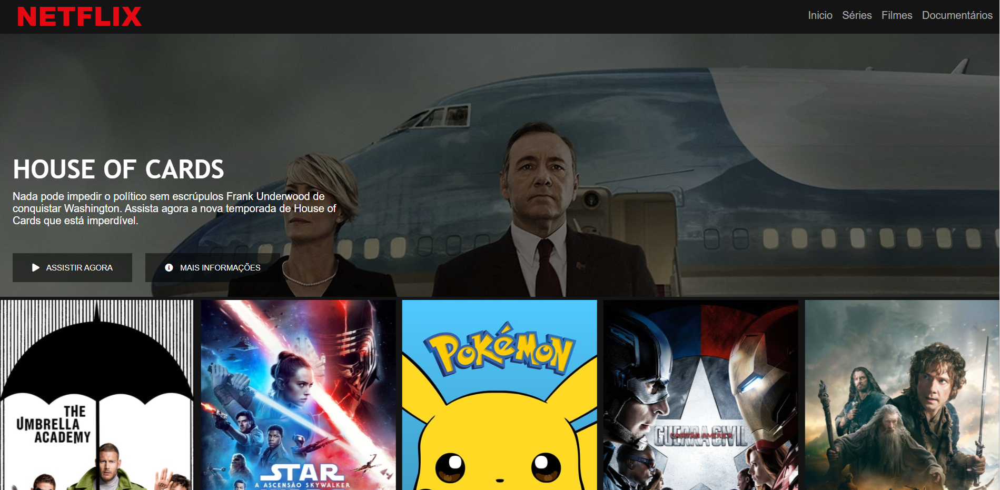
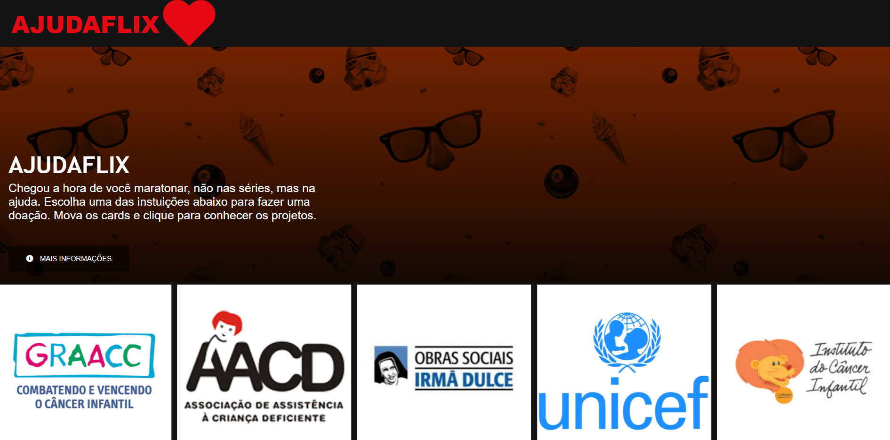

# AJUDAFLIX

Chegou a hora de você maratonar, não nas séries, mas na ajuda. Mova os cards presentes no website e clique para conhecer as instituições sociais que precisam de uma doação ❤️.

Neste projeto recriamos uma interface da página inicial do Netflix. O "Ajudaflix" exibe cards com várias insituições sociais, o usuário pode clicar nos cards presentes no carrosel para conhecer cada uma das instituições e fazer uma doação.

Esse é o repositório referente ao projeto "Recriando a Interface do Netflix" do bootcamp do Inter em parceria com a Digital Innovation One.

Em relação ao projeto original eu modifiquei: 

✅ 1-  O navbar, adicionando uma animação de coração pulsante além do alinhamento do nav.

✅ 2 - Alterei a imagem do header assim como o efeito de background, a imagem ficou mais escura do que no projeto original. Isso foi feito para dar mais destaque ao texto branco em relação a nova imagem de background. 

✅ 3- Adicionado um listener no botão "mais informações" que exibe no clique um alerta com mais detalhes sobre o funcionamento do website.

✅ 4 - Adicionei os cards referentes as instituições sociais, basta clicar no logo de cada instituição para abrir uma nova guia do navegador com o site da instituição.

🎥 Vídeo do projeto:

Abaixo temos o projeto original e o modificado.

📸 Original - Foto:

📸 Modificado no projeto - Foto:

